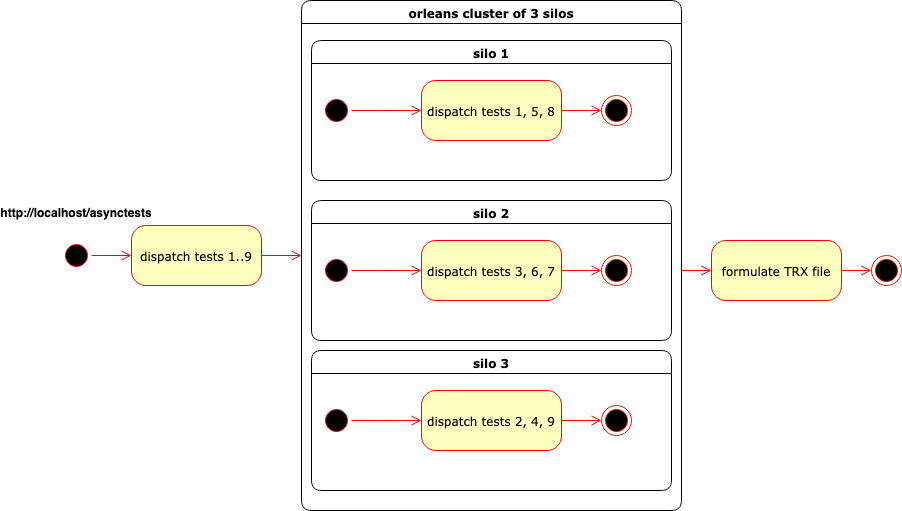
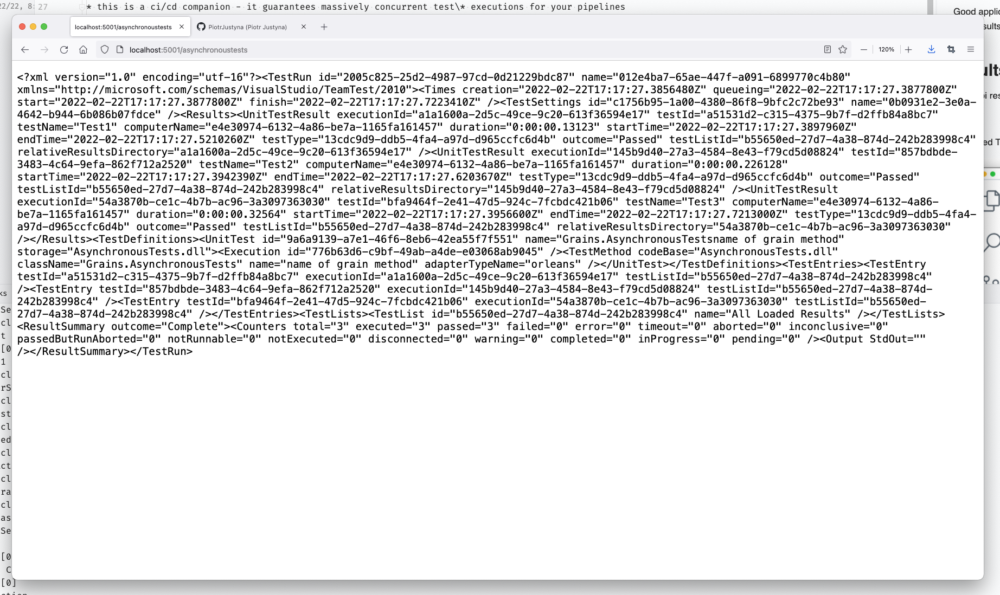
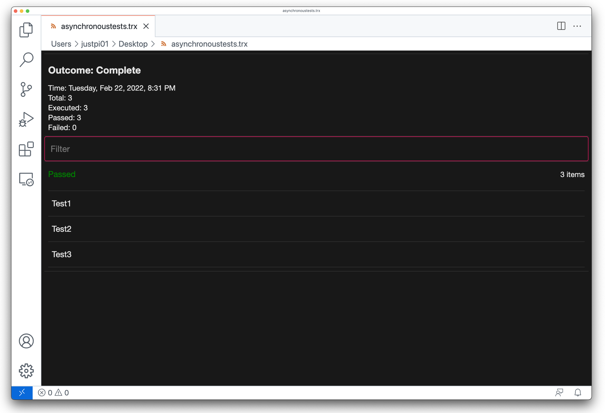

# readme

Execute asynchronous, long-running tests in Orleans and produce TRX results via an HTTP web api endpoint.

*The diagram is obviously heavily simplified as where the project shines is hundreds, thousands and more long-running asynchronous tests.*

Good application for this are large suites of smoke/integration tests that take seconds each to run. With this solution, such tests can be distributed across a cluster of many Orleans silos, executed concurrently and their results are combined into a TRX file required by build pipelines.

## results

Web api response (TRX represented as string, straight from firefox):

Produced TRX file viewed in visual studio code using a [Trx viewer](https://marketplace.visualstudio.com/items?itemName=scabana.trxviewer).

## application

At the moment, a slightly more sophisticated version of this code is used to execute our smoke tests.

### what this is

* this is a ci/cd companion - it guarantees massively concurrent test\* executions for your pipelines
* this is an alternative for the [`dotnet test`](https://docs.microsoft.com/en-us/dotnet/core/tools/dotnet-test) command if used in ci/cd contexts\*

disclaimer: **where your tests are asynchronous and long-running*

### what this is not

* this is not a replacement for any test framework (e.g. xunit)
* this is not an automatic test discovery framework - tests need to be kicked off from a starting location (here it is `AsynchronousTestsController`)
* this is not a local, development-time test execution platform - there are better test tools for that

## implementation

* individual asynchronous, long-running tests (seconds+) are implemented as Orleans grains (here they can be found in Grains -> AsynchronousTests.fs)
* tests grains are executed in whatever order is required in one starting location (here we are co-hosting Orleans and a web api, so the tests are kicked off by the api controller)
* after all tests complete, their results are consolidated into a TRX file which is:
  * universally understood by pipelines supporting .net tests results
  * returned by the api controller as string to be used further (e.g. by your ci/cd)

A big thank you to:

* https://github.com/mrblonde91
* https://github.com/Amoondria
* https://github.com/Mulpeter91
* https://github.com/BogdanBabiy
* https://github.com/aburra12
* https://github.com/jankows2
* https://github.com/gonac

who helped build this.

## run

To run, use any of the methods listed below:

* `./run-silo-local.sh`
* `./run-silo-docker.sh`
* run it from your IDE, but please make sure you have the environment variables set to e.g. `DASHBOARDPORT=8081;GATEWAYPORT=3001;PRIMARYPORT=2001;SILOPORT=2001;TESTSAPIPORT=5001`

To verify everything is working correctly:

* Dashboard: http://localhost:8081
  * [Login Credentials](https://github.com/PiotrJustyna/Palladium/blob/main/SiloHost/src/Program.fs#L76)
* API: http://localhost:5001/asynchronoustests

Provided the ports are not changed.