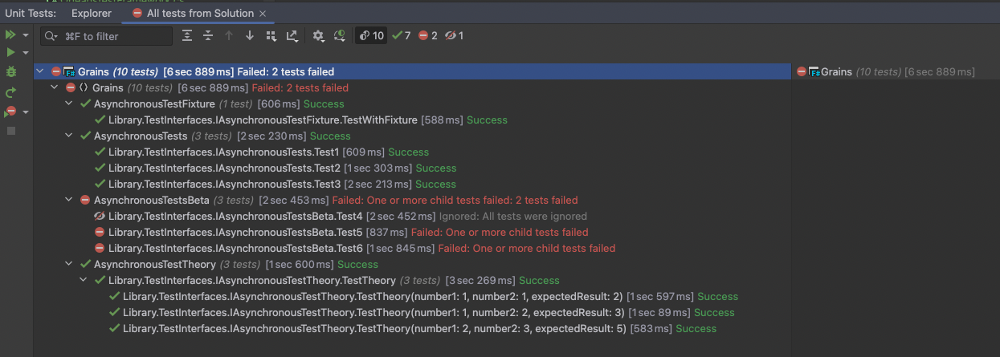
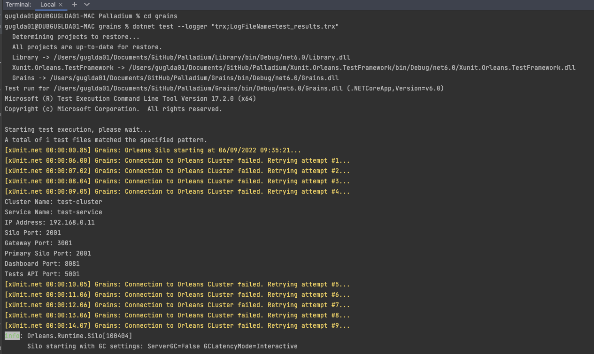
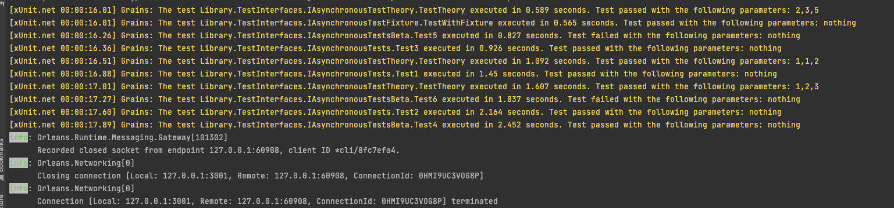
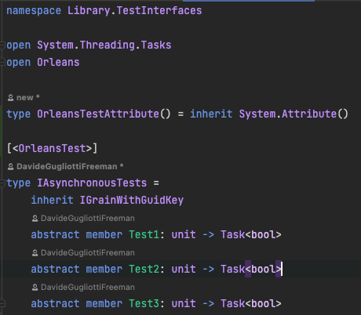
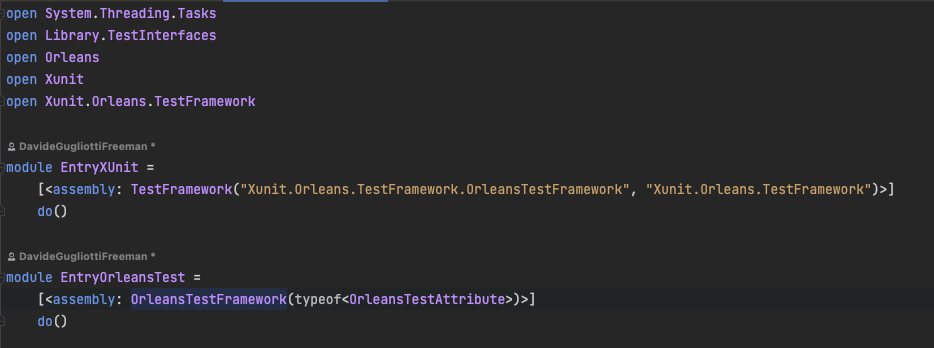

# readme
This library extends Xunit to execute asynchronous, long-running tests in Orleans.

In a nutshell, Xunit.Orleans.TestFramework uses the default Xunit test discoverer to pick up the unit tests,
and then integrates a custom executor, where a new Orleans Cluster process is created (SiloHost), a new Orleans client is connected,
and the Xunit tests are executed on the cluster.

## results
By starting your Xunit test session via the IDE, you get full integration with the test execution window.

By starting your Xunit test session via command (dotnet test), you get custom diagnostics available in the output,
as well as Orleans standard output messages.
Optionally, you can add the --logger option to get a TRX result file.

## implementation
There are several components that are custom to this solution:
* Xunit.Orleans.TestFramework includes the extension to Xunit and relies on a few environment variables (with default values)
  * CLUSTERNAME (default: 'test-cluster')
  * SERVICENAME (default: 'test-service')
  * SILOHOSTPROJECTPATH (default: path to the project SiloHost)
  * TESTSAPIPORT (default: 5001)
  * DASHBOARDPORT (default: 8081)
  * PRIMARYPORT (default: 2001)
  * SILOPORT (default: 2001)
  * GATEWAYPORT (default: 3001)
  * ADVERTISEDIP (default: obtained IP address)

* The Grains interfaces, which will be used to implement the test methods, need to be marked with a custom attribute.
This attribute can be implemented in the same project where the interfaces are implemented.

* 

* The entry point for both Xunit and the Xunit.Orleans.TestFramework.

These are 2 assembly attributes that must be specified in the assembly where the tests (grains) are implemented.
  * Xunit.TestFrameworkAttribute is needed to tell Xunit we have a custom TestFramework implementation
  * Xunit.Orleans.TestFramework.OrleansTestFrameworkAttribute is needed to tell our custom TestFramework which interfaces we can use
  to resolve the grains and run the tests, and we can optionally specify whether we want to stop the Orleans host after the test execution
  is completed.

  

## run

* Use your IDE to discover and run the Xunit tests
* Use dotnet test to run the xUnit tests from command line

### known issues
I am still working on a couple of things:
* while running the tests from IDE works flawlessly, using dotnet test results in a wrong Xunit message,
even though all tests are executed.
* There is an inconsistent time output at collection level when running Theories with inline data
